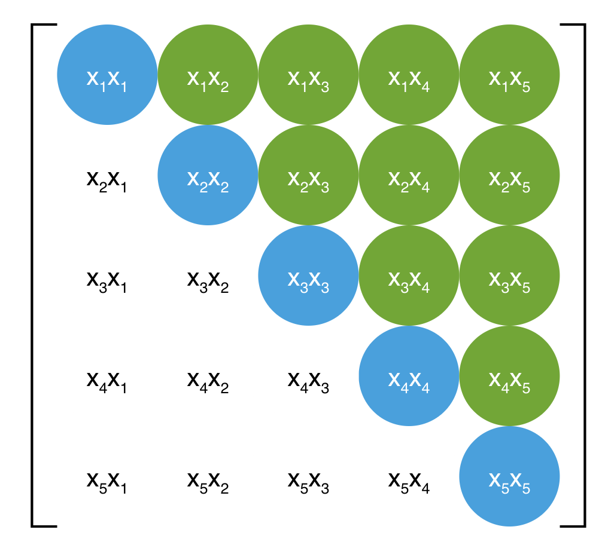

FM主要是解决稀疏数据下的特征组合问题，并且其预测的复杂度是线性的，对于连续和离散特征有较好的通用性。

# FM原理

## 背景

FM(Factorization Machine)，即因子分解机，是由Steffen Rendle提出的一种基于矩阵分解的机器学习算法。在FM提出之前，在计算广告和推荐系统中，常用的是逻辑回归(LR)方法，但是LR很难对特征组合训练，而这正是FM算法所擅长的，因此相比LR而言，FM具有更好的效果。

## 为什么需要特征组合
通过观察大量的样本数据可以发现，某些特征经过关联之后，与label之间的相关性就会提高。例如，“USA”与“Thanksgiving”、“China”与“Chinese New Year”这样的关联特征，对用户的点击有着正向的影响。换句话说：来自“China”的用户很可能会在“Chinese New Year”有大量的浏览、购买行为；而在“Thanksgiving”却不会有特别的消费行为。

这种关联特征与label的正向相关性在实际问题中是普遍存在的，如 **<“化妆品”类商品，“女”性>**，**<“球类运动配件”的商品，“男”性>**，**<“电影票”的商品，“电影”>** 品类偏好等。因此，引入两个特征的组合是非常有意义的。

## 如何进行特征组合
最直观的特征组合模型即 **多项式模型** 。在多项式模型中，特征 $x_i$ 和  $x_j$ 的组合采用  $x_i x_j$  表示，但是只有 $x_i$ 和  $x_j$ 都非零时，组合特征 $x_i x_j$  才有意义。当然多项式可以三阶，可以四阶，但三阶及以上的计算量较大，业内并不常用，因此本文只讨论二阶多项式模型。模型的表达式如下：
$$
y(X) = \omega_0 + \sum_{i=1}^n \omega_i x_i + \sum_{i=1}^{n-1} \sum_{j=i+1}^{n} \omega_{ij} x_i x_j
$$
其中，$n$ 代表样本的特征数量，$x_i$ 是第 $i$ 个特征的值，$\omega_0, \omega_i, \omega_j$ 是模型参数

从公式来看，模型前半部分就是普通的LR线性组合，后半部分的交叉项即 **特征的组合**。单从模型上来看，由于组合特征相的存在，FM的表达能力是强于LR的，至少不会比LR弱，当交叉项参数全为零时退化为普通的LR模型。

另外，从上述公式还可以看出，组合特征的参数一共有 $n(n-1)\over 2$ 个，任意两个参数都是独立的。然而，在数据稀疏性普遍存在的实际应用场景中，二次项参数的训练是很困难的。其原因是：每个参数 $\omega_{ij}$ 的训练需要大量 $x_i$ 和  $x_j$ 都非零的样本，但是在计算广告和推荐的场景中，存在大量的类别(categorical)特征，这些特征经过one-hot编码后，会变得非常稀疏，满足  $x_i$ 和  $x_j$ 都非零的样本将会非常少。训练样本的不足，很容易导致参数  $\omega_{ij}$ 不准确，最终将严重影响模型的性能。

## 为什么one-hot后会变得稀疏

以一个广告分类的问题为例，根据用户与广告位的一些特征，来预测用户是否会点击广告，本例数据来自美团技术团队分享的paper：

| Clicked? | Country | Day      | Ad_type |
| :------- | ------- | -------- | ------- |
| 1        | USA     | 26/11/15 | Movie   |
| 0        | China   | 1/7/14   | Game    |
| 1        | China   | 19/2/15  | Game    |

clicked是分类值，指用户有没有点击该广告。1表示点击，0表示未点击。而country, day, ad_type则是对应的特征。对于这种categorical特征，一般都是进行one-hot编码处理。

| Clicked? | Country=USA | Country=China | Day=26/11/15 | Day=1/7/14 | Day=19/2/15 | Ad_type=Movie | Ad_type=Game |
| :------- | :---------- | ------------- | ------------ | ---------- | ----------- | ------------- | ------------ |
| 1        | 1           | 0             | 1            | 0          | 0           | 1             | 0            |
| 0        | 0           | 1             | 0            | 1          | 0           | 0             | 1            |
| 1        | 0           | 1             | 0            | 0          | 1           | 0             | 1            |

由上表可以看出，经过one-hot编码之后，每个样本有7维特征，但平均仅有3维特征具有非零值。实际上，这种情况并不是此例独有的，在真实应用场景中这种情况普遍存在。例如，CTR/CVR预测时，用户的性别、职业、教育水平、品类偏好，商品的品类等，经过one-hot编码转换后都会导致样本数据的稀疏性。特别是商品品类这种类型的特征，假设商品的品类有550个，那么采用one-hot编码后，就有550个数值特征，但每个样本的这550个特征，有且仅有一个是有效的（非零），由此可见，数据稀疏性是实际问题中不可避免的挑战。

## FM的解决方案

下面直接给出FM模型的公式，可见，相比于上述的 **多项式模型**，仅仅将 $\omega_{ij}$ 变成 $<v_i,v_j>$ 。

$$
\hat{y}(X):=\omega_0+\sum_{i=1}^{n}{\omega_ix_i}+\sum_{i=1}^{n-1}{\sum_{j=i+1}^{n}{<v_i,v_j>x_ix_j}}
$$

$$
<v_i,v_j>:=\sum_{f=1}^{k}{v_{i,f}\cdot v_{j,f}}
$$

其中，$v_i$ 是第 $i$ 维特征的隐向量，$<.,.>$ 代表向量点积。隐向量的长度为 $k(k<<n)$ , 包含 $k$ 个描述特征的因子。根据上述公式，二次项的参数数量减少为 $kn$ 个，远少于多项式模型的参数数量。另外，参数因子化使得 $x_hx_i$ 的参数和 $x_ix_j$的参数不再是相互独立的，因为 $x_hx_i$ 的参数是 $<v_h,v_j>$ ，因为 $x_ix_j$ 的参数是 $<v_i,v_j>$ ,二者有一个共同的参数 $v_j$ 。共享参数有一个很大的优势，即所有包含 “**$x_i$ 的非零组合特征(存在某个 $j \ne i$ ,使得 $x_ix_j \ne 0$ )**” 的样本都可以用来学习隐向量 $v_i$ ,这很大程度上避免了数据稀疏性造成参数难以训练的影响，毕竟在多项式模型中 $\omega_{hi}$ 与 $\omega_{ij}$ 是相互独立的。这里需要指出，如果 $x_ix_j=0$ ,一样是无法学习 $v_i$ 或 $v_j$ 的特征的。

此外，隐向量可以表示之前没有出现过的交叉特征，假如在数据集中经常出现 **<男，篮球> ，<女，化妆品>**，但是没有出现过**<男，化妆品>，<女，篮球>**，这时候如果用 $\omega_{ij}$ 表示**<男，化妆品>** 的系数，就会得到0。但是有了男特征和化妆品特征的隐向量之后，就可以通过来 $<v_i,v_j>$ 来求解。

## FM的化简

直观上看，FM的复杂度是 $O(kn^2)$  。但是，FM的二次项可以化简，其复杂度可以优化到 $O(kn)$  。由此可见，FM可以在线性时间对新样本作出预测，是一种很高效的模型。
$$
\begin{align*} \sum_{i=1}^{n-1}{\sum_{j=i+1}^{n}{<v_i,v_j>x_ix_j}} &= \frac{1}{2}\sum_{i=1}^{n}{\sum_{j=1}^{n}{<v_i,v_j>x_ix_j}} - \frac{1}{2} {\sum_{i=1}^{n}{<v_i,v_i>x_ix_i}} \\ &= \frac{1}{2} \left( \sum_{i=1}^{n}{\sum_{j=1}^{n}{\sum_{f=1}^{k}{v_{i,f}v_{j,f}x_ix_j}}} - \sum_{i=1}^{n}{\sum_{f=1}^{k}{v_{i,f}v_{i,f}x_ix_i}} \right) \\ &= \frac{1}{2}\sum_{f=1}^{k}{\left[ \left( \sum_{i=1}^{n}{v_{i,f}x_i} \right) \cdot \left( \sum_{j=1}^{n}{v_{j,f}x_j} \right) - \sum_{i=1}^{n}{v_{i,f}^2 x_i^2} \right]} \\ &= \frac{1}{2}\sum_{f=1}^{k}{\left[ \left( \sum_{i=1}^{n}{v_{i,f}x_i} \right)^2 - \sum_{i=1}^{n}{v_{i,f}^2 x_i^2} \right]} \end{align*}
$$
**解释**：
$v_i$ 是一个向量，而 $v_{i,f}$ 是一个具体的值；
第1个等号：对称矩阵 ![[公式]](https://www.zhihu.com/equation?tex=W) 对角线上半部分；
第2个等号：把向量内积展 $<v_i,v_j>$ 展开成累加和的形式；
第3个等号：提出公共部分；
第4个等号： $i$ 和 $j$  相当于是一样的，表示成平方过程。

这里详细解释下第一个等式是如何得到的，下图展示了一个对称矩阵的示意图，示意图中省略了 $<v_i, v_j>$ ，可见：

- 右上角的绿色的即为 $\sum_{i=1}^{n-1}{\sum_{j=i+1}^{n}{<v_i,v_j>x_ix_j}}$ 
- 整体矩阵为 $\sum_{i=1}^{n}{\sum_{j=1}^{n}{<v_i,v_j>x_ix_j}}$ 
- 对角线蓝色的和为 ${\sum_{i=1}^{n}{<v_i,v_i>x_ix_i}}$

这样整体的矩阵去掉对角线，然后除以2，即可得到第一个等式。

这样，可以通过随机梯度下降进行求解，随机梯度下降即每次只放一个样本，
$$
\begin{equation} \frac{\partial \hat{y}(x) }{\partial \theta} = \left\{ \begin{array}{lr} 1, & if\ \theta\ is\ \omega_0 \\ x_i, & if\ \theta\ is\ \omega_i\\ x_i\sum_{j=1}^{n}{v_{j,f}x_j - v_{i,f}x_i^2} & if\ \theta\ is\ v_{i,f} \end{array} \right. \end{equation}
$$
**由上式可知，$v_{i,f}$ 的训练只需要样本的 $x_i$ 特征非0即可，适合于稀疏数据**

在使用SGD训练模型时，在每次迭代中，只需计算一次所有 $f$ 的 $\sum_{j=1}^{n}{v_{j,f}x_j}$ ，就能够方便得到所有 $v_{i,f}$ 的梯度，上述偏导结果求和公式中没有 $i$ ，即与 $i$ 无关，只与 $f$ 有关，显然计算所有 $f$ 的  $\sum_{j=1}^{n}{v_{j,f}x_j}$  的复杂度是 $O(kn)$  ，模型参数一共有 $nk+n+1$ 个。因此，FM参数训练的复杂度也是 $O(kn)$。综上可知，**FM可以在线性时间训练和预测**，是一种非常高效的模型。

## 隐向量 $V$ 的另一种理解

这里的 $v_i$  是 $x_i$ 特征的低维稠密表达，实际中隐向量的长度远小于特征维度，在实际的CTR场景中，数据都是很稀疏的category特征，通常表示成离散的one-hot形式，这种编码方式，使得one-hot vector非常长，而且很稀疏，同时特征总量也骤然增加，达到千万级甚至亿级别都是有可能的，而实际上的category特征数目可能只有几百维。**FM学到的隐向量可以看做是特征的一种embedding表示**，把离散特征转化为Dense Feature，这种Dense Feature还可以后续和DNN来结合，作为DNN的输入，事实上用于DNN的CTR也是这个思路来做的。

# tensorflow代码详解

参考资料：

[FM算法解析](https://zhuanlan.zhihu.com/p/37963267)

[推荐系统遇上深度学习(一)--FM模型理论和实践](https://cloud.tencent.com/developer/article/1099532)

